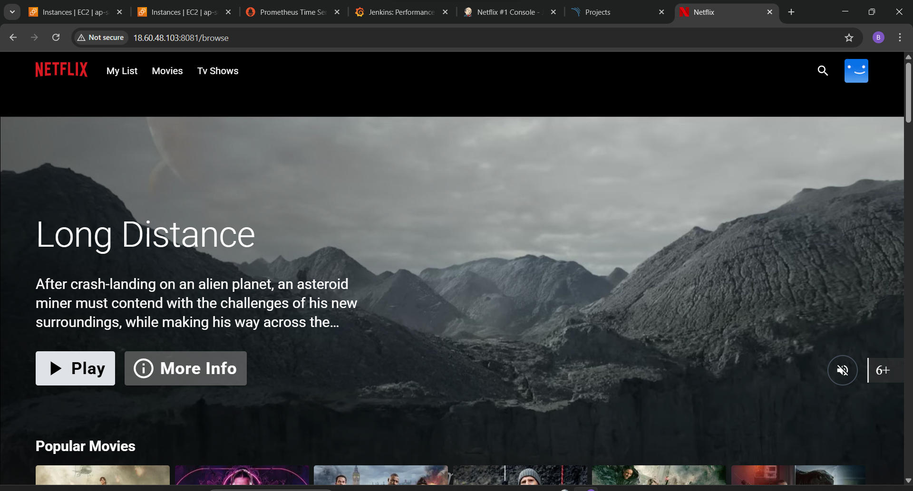

# 🎬 Netflix Clone CI/CD Pipeline with Monitoring, Security & Notifications



# 🧩 Architecture Diagram


This project demonstrates a complete CI/CD pipeline for a Netflix-style web application using **Jenkins, Docker, Kubernetes**, and **DevSecOps practices** such as **static analysis, dependency checks, image scanning**, and **email notifications**.

## 🖥️ VM Creation on AWS


  The entire CI/CD and Kubernetes infrastructure is hosted on AWS EC2 instances.
  ### Jenkins-Server
  - Install Java(JDK17)
  - Install Jenkins.
  - Install Docker.
  - Install Trivy
  - Install Node_Exporter for Prometheus/Grafana Monitoring and Configure it with Prometheus server.
  
  ### Monitoring-Server
  - Install Prometheus.
  - Install Grafana.
    ## we use Self-Managed Kubernetes Cluster

  ### K8s_Master_Node_Server
  - Install Kubernetes Master Configuration. 
  
  ### K8s_Worker_Node_Server
  - Install Kubernetes Worker Node Configuration.
---

## 🚀 Tools & Technologies Used

- **Jenkins** – CI/CD server
- **Docker** – Containerization
- **Kubernetes** – Container orchestration
- **SonarQube** – Static code analysis
- **Trivy** – File system & image vulnerability scanning
- **OWASP Dependency Check** – Dependency vulnerability scanning
- **Email Notifications** – Jenkins Email Extension Plugin
- **Monitoring** – Prometheus, Grafana (optional)

---

## 🧩 Required Jenkins Plugins

Ensure the following Jenkins plugins are installed:

| Plugin Name                     | Purpose                               |
|--------------------------------|----------------------------------------|
| Git Plugin                     | Checkout code from GitHub              |
| Pipeline                       | Declarative pipeline support           |
| NodeJS Plugin                  | Manage Node.js runtime                 |
| SonarQube Scanner              | Run static analysis via SonarQube      |
| OWASP Dependency-Check Plugin  | Scan dependencies for vulnerabilities  |
| Trivy Scanner (CLI-based)      | Manual integration via shell script    |
| Docker Pipeline                | Docker build/push integration          |
| Kubernetes CLI Plugin          | Run kubectl commands from Jenkins      |
| Email Extension Plugin         | Send build notifications via email     |
| Blue Ocean (optional)          | Improved UI for pipelines              |

---

## 🛠️ Pipeline Stages

```text
1. Clean Workspace
2. Checkout Code (GitHub)
3. Static Code Analysis (SonarQube)
4. Quality Gate Check (SonarQube)
5. NPM Dependency Installation
6. Dependency Vulnerability Check (OWASP)
7. Filesystem Scan (Trivy)
8. Docker Image Build & Push
9. Docker Image Vulnerability Scan (Trivy)
10. Deploy Container (local)
11. Kubernetes Deployment
12. Email Notification with Logs
```
---

# 🧩 Architecture Diagram

# 📝 Jenkinsfile (Pipeline as Code)
See full Jenkinsfile in Jenkinsfile in repo


```groovy

pipeline {
    agent any

    tools {
        jdk 'jdk17'
        nodejs 'node16' 
    }

    environment {
        SCANNER_HOME = tool 'sonar-scanner'
    }

    stages {
        stage('clean workspace') {
            steps {
                cleanWs()
            }
        }

        stage('checkout from Git') {
            steps {
                git branch: 'main', url: 'https://github.com/Pratik-Ahire-git/Netflix-DevSecOps-Project.git'
            }
        }

        stage("SonarQube Analysis") {
            steps {
                withSonarQubeEnv('sonar-server') {
                    sh '''$SCANNER_HOME/bin/sonar-scanner \
                        -Dsonar.projectName=Netflix \
                        -Dsonar.projectKey=netflix'''
                }
            }
        }

        stage("Quality Gate") {
            steps {
                script {
                    waitForQualityGate abortPipeline: false, credentialsId: 'sonar-token'
                }
            }
        }

        stage('Install Dependencies') {
            steps {
                sh 'npm install'
            }
        }

        stage('OWASP FS SCAN') {
            steps {
                dependencyCheck additionalArguments: '--scan ./ --disableYarnAudit --disableNodeAudit', odcInstallation: 'DP-Check'
                dependencyCheckPublisher pattern: '**/dependency-check-report.xml'
            }
        }

        stage('TRIVY FS SCAN') {
            steps {
                sh "trivy fs . > trivyfs.txt"
            }
        }

        stage("Docker Build and Push") {
            steps {
                script {
                    withDockerRegistry(credentialsId: 'docker', toolName: 'docker') {
                        sh "docker build --build-arg TMDB_V3_API_KEY=95c73e3eef62f13c14960b30f72dffe3 -t netflix ."
                        sh "docker tag netflix pratik023/netflix:latest"
                        sh "docker push pratik023/netflix:latest"
                    }
                }
            }
        }
        
        stage("Docker Image Scan") {
            steps {
                sh "trivy image pratik023/netflix:latest > trivyimage.txt"
            }
        }

        stage("Deploy the container") {
            steps {
                sh "docker run -d -p 8081:80 pratik023/netflix:latest"
            }
        }
        stage('Deploy to kubernets'){
            steps{
                script{
                    dir('Kubernetes') {
                        withKubeConfig(caCertificate: '', clusterName: '', contextName: '', credentialsId: 'k8s', namespace: '', restrictKubeConfigAccess: false, serverUrl: '') {
                                sh 'kubectl apply -f deployment.yml'
                                sh 'kubectl apply -f service.yml'
                        }   
                    }
                }
            }
        }
    }

    post {
        always {
            emailext attachLog: true,
                subject: "'${currentBuild.result}'",
                body: "Project: ${env.JOB_NAME}<br/>" +
                      "Build Number: ${env.BUILD_NUMBER}<br/>" +
                      "URL: ${env.BUILD_URL}<br/>",
                to: 'demondevops1@gmail.com',
                attachmentsPattern: 'trivyfs.txt,trivyimage.txt'
        }
    }
}
```
---


# 📸 Screenshots

## ✅ Jenkins Pipeline Execution


____
## ✅ SonarQube Code Quality


---
## ✅ OWASP Dependency Report

